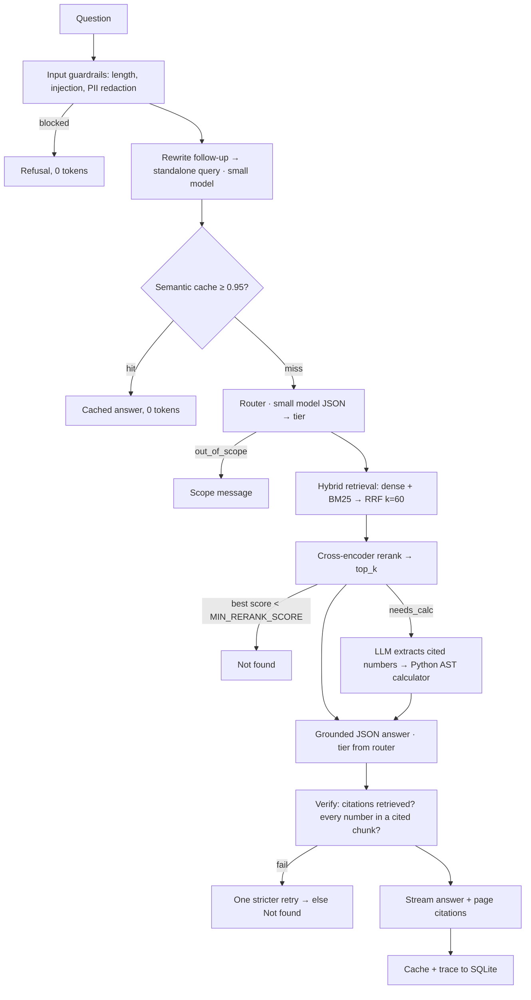

# FilingLens

Grounded Q&A over company annual reports and SEC filings. Upload a report, ask questions in plain English, and get answers that cite their page. Numbers are calculated in Python, not by the LLM. When the documents don't support an answer, it says "Not found in the provided documents" instead of guessing.

## Architecture



| Layer | Choice |
|---|---|
| API | FastAPI, with SSE streaming of typed events (`step`, `token`, `chart`, `citations`, `suggestions`, `done`, `error`) |
| UI | Next.js 16 (App Router), TypeScript, Tailwind 4, shadcn/ui, lucide-react, recharts |
| LLM | LiteLLM locally (OpenAI, Azure OpenAI, Anthropic, Gemini, Groq, Ollama); a slim OpenAI-compatible client in cloud mode. Small/large tiers plus a fallback chain |
| Parsing | PyMuPDF + pymupdf4llm: per-page markdown, tables kept whole, 4 parallel workers. PDF, HTML (SEC filings), TXT/MD, EPUB |
| Embeddings, BM25, rerank | Local: fastembed (bge-small-en-v1.5, Qdrant/bm25, ms-marco-MiniLM-L-6-v2) on CPU. Cloud: Jina embeddings v3 and Jina reranker, plus a pure-Python BM25 |
| Vector DB | Qdrant (embedded on disk locally, Qdrant Cloud when deployed) with named `dense` and `sparse` vectors |
| Storage | SQLite locally, Postgres (Neon) when deployed: users, auth sessions, documents and file pieces, chats, summaries, memories, cache, traces |
| Auth | Email + password (scrypt), opaque bearer tokens stored hashed, a guest trial with credits, roles guest / user / admin |

## Features beyond the core pipeline

- **Grounded charts:** ask "how has X changed over the years?" and get a chart in which every value was checked against its cited page.
- **Related questions:** 3 suggested follow-ups after each answer.
- **Deep research:** a toggle that splits the question into sub-questions, reads more of the report and writes a structured answer.
- **Accounts and free trial:** visitors start as a guest (5 questions, 1 document). Signing up keeps everything from the trial; accounts get 200 questions a month and 20 documents. Every document, chat, memory and trace belongs to one account.
- **Chat history:** saved chats with search. Each chat has a ⋯ menu to pin, rename or delete it, and pinned chats get their own section at the top. Long chats stay fast because older turns are summarised.
- **Profile menu:** the sidebar's profile icon shows your email, links to Settings and logs you out.
- **Usage alerts:** a notification when this session's tokens or estimated spend pass limits you set in Settings, and at 80% of the session token budget.
- **Cross-chat memory (opt-in):** remembers your preferences across chats. View and delete memories in Settings.
- **Web search (Tavily, optional):** used automatically only when your documents can't answer, and clearly labelled.
- **See the real page:** citations open the actual page with the cited passage highlighted, or the extracted text.
- **Plain-English key terms:** jargon in an answer (float, GAAP, underwriting…) is explained underneath, labelled as general definitions, never as document facts.
- **Executive briefing, document scope, export:** a one-click Deep-research overview of a report, a picker for which documents a chat searches, and Markdown export of a thread.

A guided tour of how everything works, with measured numbers and interview questions, is in [docs/STUDY_GUIDE.md](docs/STUDY_GUIDE.md).

## Run locally

Requires Python 3.11+, Node 20+, and GNU make (optional; the raw commands are in the `Makefile`).

```bash
make install            # venv + pip install + npm ci
cp .env.example .env    # optional; defaults work
cp frontend/.env.local.example frontend/.env.local
make api                # http://localhost:8000  (docs at /docs); API_PORT=8001 to change
make ui                 # http://localhost:3000
make test               # backend tests (no API key needed: LLM calls are faked)
```

Then:
1. You start as a guest on the free trial. Sign up from the sidebar to keep your work.
2. Open **Settings** and pick a provider. Paste an API key, or choose Ollama, which needs no key.
3. Click **Test connection**.
4. On **Documents**, upload a PDF, HTML, TXT/MD or EPUB file. A 150-page report indexes in about 2 minutes on a laptop CPU, with live progress.
5. Ask questions in **Chat**.

On Windows without make, `start.bat` starts the API and the UI together.

### Deploy (free): everything on Vercel

Live at https://filinglens-analyst-companion.vercel.app. The UI and the API (cloud mode: Neon Postgres, Qdrant Cloud, Jina AI) both run on Vercel. Step-by-step: [docs/DEPLOY.md](docs/DEPLOY.md).

### Docker

```bash
docker compose up --build    # UI on :3000, API on :8000, data in a named volume
```

`Dockerfile.space` builds a single-container image for Hugging Face Spaces (port 7860). Next.js serves the UI and proxies `/api/*` to FastAPI inside the container, so the browser stays on one origin.

## Your API key

- The key is stored only in the browser tab's `sessionStorage`. It is never put in `localStorage` or cookies, and it disappears when the tab closes or when you log out.
- A guest who signs up or logs in keeps the key in that tab, so it doesn't need to be pasted again.
- It is sent per request as `X-LLM-Key`, used for that request only, never written to disk or logs, and masked out of any error text returned to the UI.
- CORS allows only `FRONTEND_ORIGIN` (plus `FRONTEND_ORIGIN_REGEX` for preview URLs).

## Accounts, credits and roles

| | Guest (automatic) | Account (email + password) | Admin (listed in `ADMIN_EMAILS`) |
|---|---|---|---|
| Questions | 5 in total | 200 per month | Unlimited |
| Documents | 1, up to 10 MB | 20, up to `MAX_UPLOAD_MB` each | Unlimited count, up to `MAX_UPLOAD_MB` each; sees every document |
| Session length | 7 days | 30 days | 30 days |
| Extras | | | `/admin/users`, credit reset, `/retrieve`, Insights across all users |

- **Sign-up upgrades the guest in place**, so trial chats and documents carry over. Logging in from a guest session merges the guest's data into the account.
- **Tokens:** opaque random bearer tokens, stored only as SHA-256 hashes and revoked on log-out. Passwords use scrypt and need 10+ characters with an uppercase letter and a digit.
- **Abuse limits:** guest creation per IP per hour, login attempts per 15 minutes, and one generic "wrong email or password" error.
- **Credits:** a question is charged atomically before it runs and refunded if the answer fails. An empty allowance returns 402, and the UI opens the sign-up dialog.
- **Isolation:** every query is scoped to the owner. Another user's document, chat or page image returns 404, so ids can't be probed. The bundled sample report is public and read-only.
- **Browser headers:** a strict Content-Security-Policy in production, plus `X-Frame-Options: DENY`, `nosniff` and a tight Referrer-Policy on both the UI and the API.

Limits live in `backend/app/config.py` and can be overridden with env vars: `ADMIN_EMAILS`, `GUEST_QUESTIONS`, `GUEST_DOCUMENTS`, `GUEST_UPLOAD_MB`, `USER_QUESTIONS_PER_MONTH`, `USER_DOCUMENTS`, `SESSION_DAYS`, `GUEST_SESSION_DAYS`, `GUESTS_PER_IP_PER_HOUR`, `LOGIN_ATTEMPTS_PER_15MIN`.

## Evaluation

`make eval` indexes `eval/data/report.pdf` (Berkshire Hathaway 2023 Annual Report, 152 pages) into a separate index. It then scores `eval/golden.jsonl`: 20 questions, 3 of which the report can't answer. Results go to `eval/results.md`.

Retrieval results (local models, no LLM):

| Metric | Value |
|---|---|
| Hit@5 | 0.94 |
| MRR | 0.68 |
| Hit@3 / Hit@8 | 0.76 / 1.00 |
| Abstention accuracy, retrieval gate only (threshold 0.0) | 0.95 |
| Rerank latency per question (this laptop CPU) | about 1.0 s (was 2.5 s with a pool of 20) |
| Indexing a 152-page PDF | 129 s (was about 208 s) |

How these were tuned, with before/after tables, is in [eval/TUNING.md](eval/TUNING.md).

The answer metrics need an LLM: citation precision, abstention accuracy end to end, answer accuracy, faithfulness, cost and latency. To run them:

```bash
EVAL_PROVIDER=openai EVAL_SMALL_MODEL=gpt-5-mini EVAL_LARGE_MODEL=gpt-5 EVAL_LLM_KEY=sk-... make eval
```

> The golden set was drafted from the report with page numbers checked against the PDF text. Review every pair yourself before quoting any number.

## Known limitations

- **Parser:** pymupdf4llm garbles some complex tables. The page-19 performance table loses its row labels, so "overall gain 1964–2023" isn't retrievable.
- **Retrieval gate:** a question about a missing year ("revenue in 2025") still scores high on rerank because the topic matches. Only the answer step can abstain on it. The verifier is the backstop.
- **Number verification** accepts any number that equals a cited number at some ×1000 scale after rounding, and ignores small integers (≤ 10). It catches invented figures, not every misattributed one.
- **Streaming:** the answer is streamed only after it passes verification. Pipeline steps stream live, but the first answer token arrives after generation finishes. This is deliberate: an unverified number never reaches the screen.
- **HTML filings:** MuPDF's layout of SEC HTML can clip narrow table labels (the numbers survive). Inline-XBRL facts aren't used yet.
- **Embedding is now the indexing bottleneck** (about 90 s of the 129 s on CPU).
- **Embedded Qdrant** is single-process. Run one API worker, or switch to a Qdrant server to scale out.
- **Trace storage:** traces keep the question after PII redaction, never the API key.
- **Cost in cloud mode** is an estimate from a built-in list-price table (`llm/gateway.py`); models not in it count as $0.
- **Cloud retrieval** (Jina models) hasn't been tuned on the golden set yet; the numbers above are local mode.
- **No password reset or email verification yet:** the free stack has no email service.
